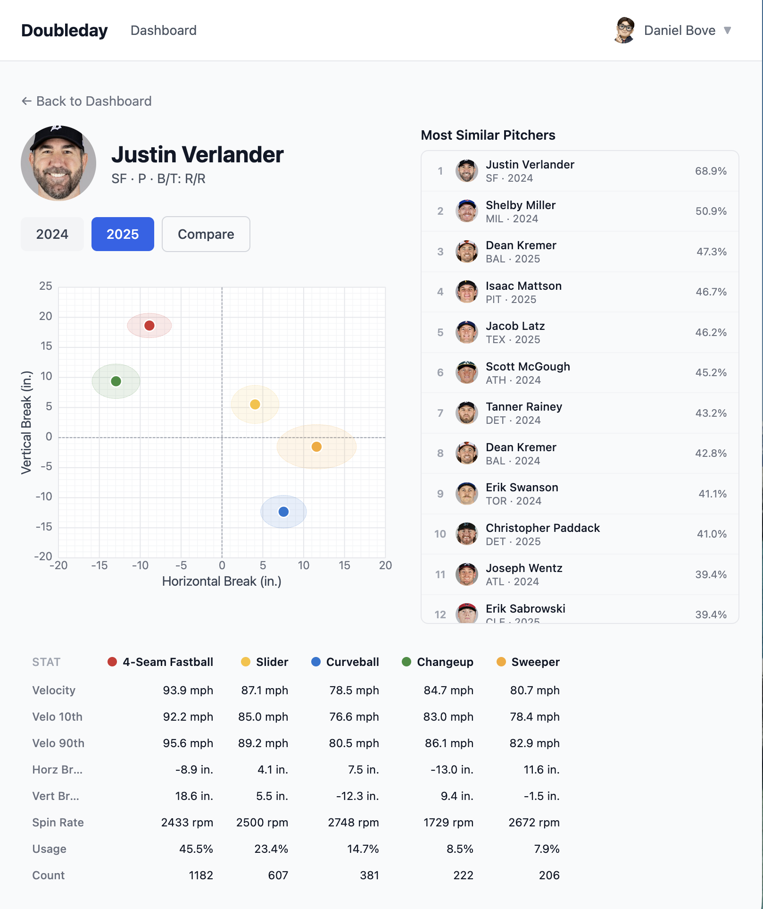
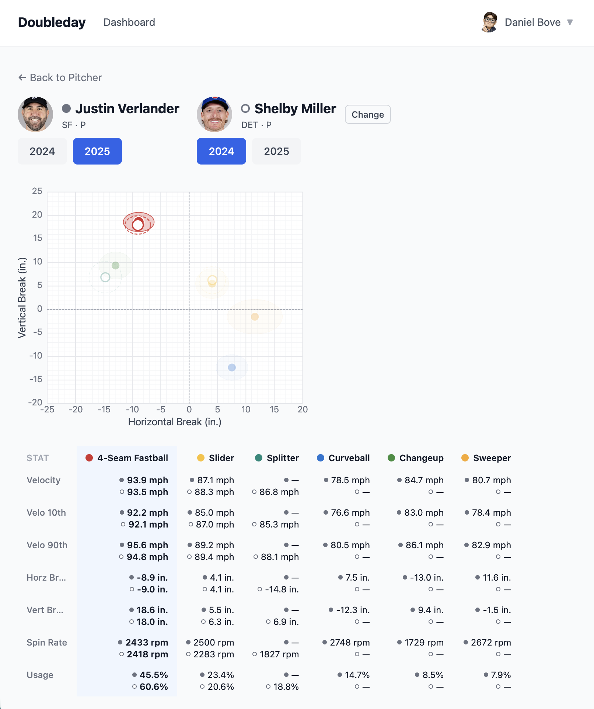
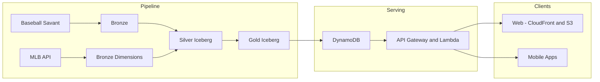

# Doubleday

A production-grade, serverless data platform for MLB pitch analysis — designed and built end-to-end on AWS.

Doubleday ingests pitch-by-pitch Statcast data, processes it through a medallion-architecture lakehouse (S3 + Iceberg + Athena), and serves precomputed analytical views via a low-latency API and cross-platform app (web + mobile).

The system is designed around a few core constraints:

- **Full-season backfills (~275 days) in a single execution** via Step Functions  
- **Idempotent, partition-safe processing** with deterministic overwrite semantics  
- **Precomputed serving layer** (DynamoDB) enabling **sub-10ms API reads**  
- **Serverless-first architecture** — no clusters, no long-lived compute  
- **Cost-efficient reprocessing** through bronze-layer caching and incremental dimension loading  

This project spans the full stack:

- Data pipeline design (medallion architecture, Iceberg, partitioning strategy)  
- Orchestration and failure handling (Step Functions, Lambda)  
- API design and low-latency serving (API Gateway, DynamoDB, Cognito)  
- Infrastructure as code and CI/CD (Terraform, GitHub Actions OIDC)  
- Cross-platform frontend (Expo React Native for web + mobile)  

Design tradeoffs (MERGE vs overwrite, orchestration vs event-driven execution, OLAP vs serving layer) are documented in the sections below.

## Demo: Pitch Analysis & Comparison

Doubleday provides interactive pitch-level analysis with direct visual comparison across pitchers and seasons.

### Pitch Profile & Movement

Each pitcher’s arsenal is visualized in a movement chart:

- **Horizontal vs vertical break** plotted for every pitch type
- Confidence ellipses show pitch distribution and consistency
- Color-coded pitch types (fastball, slider, curveball, etc.)
- Immediate visual understanding of pitch shape and separation

Below the chart, detailed metrics are precomputed and served directly:

- Velocity (avg / p10 / p90)
- Movement (horizontal & vertical break)
- Spin rate
- Usage %

All values are sourced from gold-layer aggregates and served with low-latency API reads.

### Similarity Search

Doubleday computes pitcher similarity based on pitch shape and repertoire characteristics.

- Ranked list of most similar pitchers
- Cross-season comparisons (e.g., 2024 vs 2025)
- Enables discovery of comparable arsenals and evolution over time

This is powered by precomputed similarity tables in the gold layer, avoiding runtime joins or heavy computation.

### Side-by-Side Comparison

Users can directly compare two pitchers:

- Overlay pitch movement profiles
- Compare velocity, spin, and usage distributions
- Identify differences in pitch design and effectiveness

All comparisons are backed by precomputed aggregates, ensuring consistent performance regardless of dataset size.

### Mobile Experience

A native mobile experience (iOS / Android via Expo) provides the same analysis on-device.

- Optimized layouts for touch interaction
- Fast API responses via DynamoDB-backed endpoints
- Shared codebase across web and mobile

## Key Design Decisions

-   **Partition overwrite (DELETE + INSERT) over MERGE**
    -   Source data is immutable per (season, game_date)
    -   Guarantees canonical tables exactly match source on reprocess
    -   Avoids MERGE complexity and missed deletions
-   **Single Step Function as the only entry point**
    -   No S3 triggers or side-channel execution
    -   Eliminates double-processing and race conditions
    -   Centralizes observability and failure handling
-   **Iceberg + Athena instead of Spark/Databricks**
    -   Fully serverless (no cluster lifecycle)
    -   Sufficient for batch workloads with strong partition pruning
    -   Lower operational overhead
-   **DynamoDB serving layer**
    -   Precomputed data → single-digit ms reads
    -   Avoids query-time joins over Iceberg

## Architecture

A Step Function orchestrates the pipeline end-to-end:

1.  Download raw Statcast data into bronze (S3)
2.  Type and validate into silver Iceberg tables
3.  Aggregate into gold analytical tables
4.  Load into DynamoDB for low-latency serving

Dimension data (teams, players, games, umpires) is fetched from the MLB
API and cached in bronze to make backfills cheap and repeatable.

See [`docs/ARCHITECTURE.md`](docs/ARCHITECTURE.md) for design rationale (partition overwrite vs MERGE, Standard vs Express Step Functions, etc.).

## Pipeline

The pipeline follows a strict medallion architecture with full partition
replacement:

-   **Bronze** --- raw, immutable source (CSV + JSON caches)
-   **Silver** --- strongly typed canonical tables (Iceberg)
-   **Gold** --- precomputed analytical views (no incremental merges)

All transformations are **idempotent at the partition level**.

See:
- [`docs/PIPELINE.md`](docs/PIPELINE.md) — Step Function orchestration, Lambda flow, and failure handling
- [`docs/DATALAKE.md`](docs/DATALAKE.md) — Iceberg schema design, partitioning, and table definitions
- [`docs/TESTING.md`](docs/TESTING.md) — unit and integration test strategy

## Scale & Performance

-   Full-season backfill (\~275 game dates) in a single Step Function
    execution
-   Bronze caching eliminates repeated external API calls
-   Athena queries rely on strict partition pruning
    `(season, game_date)`
-   DynamoDB serving layer provides single-digit millisecond reads
-   Pipeline concurrency tuned via Step Function map states

## API

Authenticated REST API serving gold-layer data.

| Method | Path | Description |
|--------|------|-------------|
| GET | `/pitchers/{id}/pitches` | Pitch-shape stats |
| GET | `/pitchers/{id}/neighbors` | Similar pitchers |
| GET | `/catalog` | Player catalog |

See [`docs/API.md`](docs/API.md) for endpoint design and request/response structure, [`docs/openapi.yaml`](docs/openapi.yaml) for the OpenAPI spec, and [`docs/STRIPE.md`](docs/STRIPE.md) for subscription and webhook integration.

## Frontend

Expo React Native app (iOS, Android, Web):

-   Pitcher profiles with movement charts
-   Similarity search across seasons
-   Side-by-side comparisons
-   Typeahead search with local caching
-   Cognito auth with Google federation

See [`docs/RELEASE.md`](docs/RELEASE.md) for iOS build and distribution.

## Infrastructure

Terraform-managed AWS infrastructure:

-   Step Functions, Lambda, EventBridge
-   S3 + Iceberg + Glue
-   DynamoDB serving layer
-   API Gateway + Cognito
-   CloudFront + S3 frontend
-   GitHub Actions (OIDC) CI/CD

See [`docs/INFRASTRUCTURE.md`](docs/INFRASTRUCTURE.md) for Terraform modules, CI/CD workflows, and deployment. See [`docs/OPERATIONS.md`](docs/OPERATIONS.md) for operational runbooks.

## Tech Stack

**Data Platform:** S3, Apache Iceberg, Athena, Glue\
**Orchestration:** Step Functions, Lambda, EventBridge\
**Serving:** API Gateway, Lambda, DynamoDB, Cognito\
**Frontend:** Expo (React Native), CloudFront\
**Infrastructure:** Terraform, GitHub Actions (OIDC)\
**Build & Quality:** Bazel, pytest, Ruff, mypy

See [`docs/DEVELOPMENT.md`](docs/DEVELOPMENT.md) for setup, commands, and code standards.

## Documentation

Detailed design and operational notes:

- [`docs/ARCHITECTURE.md`](docs/ARCHITECTURE.md) — system structure and execution models
- [`docs/PIPELINE.md`](docs/PIPELINE.md) — ETL orchestration and Lambda workflows
- [`docs/DATALAKE.md`](docs/DATALAKE.md) — table design and Iceberg layout
- [`docs/API.md`](docs/API.md) — REST API
- [`docs/INFRASTRUCTURE.md`](docs/INFRASTRUCTURE.md) — AWS + Terraform setup
- [`docs/OPERATIONS.md`](docs/OPERATIONS.md) — runbook for Lambda invocations and data management
- [`docs/TESTING.md`](docs/TESTING.md) — unit and integration testing strategy
- [`docs/DEVELOPMENT.md`](docs/DEVELOPMENT.md) — setup, commands, code standards, project layout
- [`docs/STRIPE.md`](docs/STRIPE.md) — Stripe integration, subscriptions, webhooks
- [`docs/RELEASE.md`](docs/RELEASE.md) — iOS release guide (EAS, TestFlight, App Store)
- [`docs/openapi.yaml`](docs/openapi.yaml) — OpenAPI 3.0 spec
